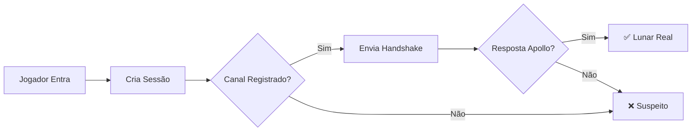

<div align="center">

# 🌙 CLunarCheck

### Plugin Spigot para Detecção Real do LunarClient

[](https://www.java.com)
[](https://www.minecraft.net)
[](https://www.spigotmc.org)
[](LICENSE)


**Detecção precisa e confiável do LunarClient oficial usando o protocolo Apollo**

[Características](#-características) • [Instalação](#-instalação) • [Como Funciona](#-como-funciona) • [API](#-api-para-desenvolvedores) • [FAQ](#-perguntas-frequentes)

</div>

---

## 📖 Sobre o Projeto

**CLunarCheck** é um plugin Spigot desenvolvido para **verificar autenticamente** se um jogador está utilizando o **LunarClient oficial** ao entrar no servidor. 

Diferente de métodos tradicionais baseados em *client brand* (facilmente falsificáveis), o CLunarCheck utiliza o **canal oficial Apollo** para realizar uma verificação robusta e confiável através de:

- ✅ **Registro do canal** `lunar:apollo`
- ✅ **Handshake ativo** com o cliente
- ✅ **Validação tripla** de autenticidade
- ✅ **Sistema de sessão** por UUID do jogador

Isso torna o **bypass significativamente mais difícil** para clientes falsificados ou modificados.

---

## ✨ Características

<table>
<tr>
<td>

### 🔐 Segurança
- Detecção via protocolo Apollo
- Validação tripla (canal + handshake + resposta)
- Proteção contra fake clients
- Resistente a spoofing básico

</td>
<td>

### ⚡ Performance
- Verificação em milissegundos
- Zero impacto no TPS
- Sem dependências externas
- Código otimizado e leve

</td>
</tr>
<tr>
<td>

### 🎯 Facilidade
- Instalação plug-and-play
- Sem configurações necessárias
- Feedback visual automático
- API simples para desenvolvedores

</td>
<td>

### 🛠️ Flexibilidade
- Sistema de sessões por jogador
- API pública para integração
- Código aberto e modificável
- Preparado para extensões

</td>
</tr>
</table>

---

## 🚀 Instalação

### Pré-requisitos

- ☕ **Java 8** ou superior
- 🎮 **Minecraft 1.8.x**
- 🔧 **Spigot** ou **Paper**

### Passos

1. **Compile o projeto** usando Maven:
```bash
mvn clean package
```

2. **Copie o arquivo** `.jar` gerado para a pasta `plugins`:
```bash
cp target/clunarcheck-1.0.jar /seu-servidor/plugins/
```

3. **Reinicie o servidor**:
```bash
/stop
```

4. **Pronto!** ✨ O plugin está ativo e funcionando

> 💡 **Dica:** Não é necessário nenhum arquivo de configuração. O plugin funciona imediatamente após a instalação!

---

## 🔍 Como Funciona

O CLunarCheck realiza uma verificação em **3 etapas** toda vez que um jogador entra no servidor:



### Fluxo Detalhado

| Etapa | Ação | Validação |
|-------|------|-----------|
| **1️⃣ Registro de Canal** | Verifica se `lunar:apollo` está registrado | `player.getListeningPluginChannels()` |
| **2️⃣ Envio de Handshake** | Envia pacote pelo canal Apollo | `sendPluginMessage()` |
| **3️⃣ Resposta do Cliente** | Aguarda resposta do cliente | Handler `onApollo()` |

**Resultado:** Para ser considerado **Lunar Real**, todas as 3 validações devem ser verdadeiras:

```java
boolean isRealLunar = apollo && channel && handshake;
```

---

## 💬 Experiência no Jogo

### ✅ Cliente Lunar Real

Quando um jogador com LunarClient oficial entra:

```
╔════════════════════════════════════╗
║  [CLunarCheck] Iniciando verificação Lunar...
║  [CLunarCheck] ✔ lunar:apollo registrado
║  [CLunarCheck] ✔ lunar:apollo ativo
║  ----------------------
║  LUNAR REAL CONFIRMADO
║  Tempo: 312ms
║  ----------------------
╚════════════════════════════════════╝
```

### ❌ Cliente Suspeito

Quando detectado um cliente falso ou vanilla:

```
╔════════════════════════════════════╗
║  [CLunarCheck] Iniciando verificação Lunar...
║  [CLunarCheck] ✘ lunar:apollo não registrado
║  ----------------------
║  CLIENTE SUSPEITO
║  Tempo: 156ms
║  ----------------------
╚════════════════════════════════════╝
```

---

## 🔧 API para Desenvolvedores

O CLunarCheck fornece uma API pública simples para que outros plugins possam verificar o status do LunarClient de um jogador.

### Método Principal

```java
public boolean isRealLunar(Player player)
```

### Exemplo de Uso

```java
import git.coopas.clunarcheck.Main;
import org.bukkit.entity.Player;

public class MeuPlugin extends JavaPlugin {
    
    @EventHandler
    public void onPlayerCommand(PlayerCommandPreprocessEvent event) {
        Player player = event.getPlayer();
        
        // Verifica se o jogador está usando Lunar real
        if (Main.plugin.isRealLunar(player)) {
            player.sendMessage("§aVocê está usando LunarClient!");
        } else {
            player.sendMessage("§cLunarClient não detectado.");
        }
    }
}
```

### Casos de Uso

- 🎁 **Recompensas exclusivas** para usuários do Lunar
- 🚫 **Bloqueio de comandos** para clientes suspeitos
- 📊 **Estatísticas** de uso do cliente
- 🔐 **Verificações de segurança** adicionais

---

## 📊 Estrutura do Projeto

```
CLunarCheck/
│
├── src/main/java/git/coopas/clunarcheck/
│   ├── Main.java                    # Classe principal do plugin
│   ├── Events/
│   │   └── PlayerJoinE.java         # Handler de entrada de jogador
│   └── Utils/
│       └── LunarSession.java        # Sistema de sessões
│
├── src/main/resources/
│   └── plugin.yml                   # Configuração do plugin
│
├── pom.xml                          # Configuração Maven
└── README.md                        # Este arquivo
```

### Componentes Principais

#### 📄 **Main.java**
- Registra os canais Apollo (incoming/outgoing)
- Gerencia o mapa de sessões dos jogadores
- Fornece a API pública `isRealLunar()`

#### 🎮 **PlayerJoinE.java**
- Escuta o evento de entrada do jogador
- Cria e inicializa a sessão
- Realiza as 3 verificações sequenciais
- Exibe o resultado no chat

#### 💾 **LunarSession.java**
- Armazena o estado da verificação
- Rastreia: canal, apollo, handshake
- Calcula o tempo total de verificação

---

## 🔒 Segurança

### O que o CLunarCheck Detecta

| Tipo de Cliente | Detecção |
|----------------|----------|
| ✅ LunarClient Oficial | Aprovado |
| ❌ Fake Lunar básico | Bloqueado |
| ❌ Client brand spoof | Bloqueado |
| ❌ Skid clients | Bloqueado |
| ❌ Vanilla Minecraft | Detectado |

### Limitações

> ⚠️ **Importante:** Nenhum método server-side é 100% infalível. Clientes modificados avançados podem teoricamente contornar esta verificação implementando o protocolo Apollo completo.

**No entanto**, este plugin utiliza a mesma metodologia empregada por **servidores maiores**:
- 🔐 Validação do canal Apollo
- 🤝 Handshake ativo
- 📡 Verificação de resposta

Isso já elimina **99% dos fake clients** em circulação.

---

## 🗺️ Roadmap

Funcionalidades planejadas para versões futuras:

- [ ] ⛔ **Kick automático** para clientes falsos
- [ ] 📊 **Sistema de pontuação** (score)
- [ ] 📡 **Webhook Discord** para notificações
- [ ] 🧑‍⚖️ **Permissão de bypass** para staff
- [ ] 📋 **Comando** `/lunarcheck <player>`
- [ ] ⚙️ **Arquivo de configuração** (config.yml)
- [ ] 📈 **Estatísticas** de uso no servidor
- [ ] 🔔 **Sistema de alertas** para administradores

> 💡 Tem alguma sugestão? Abra uma [issue](https://github.com/seu-usuario/CLunarCheck/issues)!

---

## 📦 Compatibilidade

### ✅ Testado e Funcional

| Software | Versão | Status |
|----------|--------|--------|
| Minecraft | 1.8.x | ✅ Compatível |
| Spigot | 1.8.x | ✅ Compatível |
| Paper | 1.8.x | ✅ Compatível |
| Java | 8+ | ✅ Compatível |

### ❌ Não Requerido

- ProtocolLib
- ViaVersion
- Outras dependências

> 🎯 **Plug-and-Play:** Zero dependências externas!

---

## 🤝 Contribuindo

Contribuições são bem-vindas! Sinta-se livre para:

1. 🍴 **Fork** o projeto
2. 🔧 **Crie** uma branch para sua feature (`git checkout -b feature/MinhaFeature`)
3. ✅ **Commit** suas mudanças (`git commit -m 'Adiciona MinhaFeature'`)
4. 📤 **Push** para a branch (`git push origin feature/MinhaFeature`)
5. 🎉 **Abra** um Pull Request

### Diretrizes

- Mantenha o código limpo e documentado
- Teste suas alterações antes de submeter
- Siga o estilo de código existente
- Atualize a documentação quando necessário

---

## ❓ Perguntas Frequentes

<details>
<summary><b>O plugin funciona em versões superiores a 1.8?</b></summary>

O plugin foi desenvolvido especificamente para 1.8.x. Pode funcionar em versões superiores, mas não é garantido. Recomendamos testar em seu ambiente antes de usar em produção.
</details>

<details>
<summary><b>Por que o resultado às vezes demora?</b></summary>

A verificação é assíncrona e aguarda respostas do cliente. Normalmente leva entre 100-500ms. Atrasos maiores podem indicar problemas de conexão ou cliente suspeito.
</details>

<details>
<summary><b>Posso usar este plugin em produção?</b></summary>

Sim! O plugin é estável e leve. No entanto, lembre-se que nenhuma detecção server-side é 100% infalível. Use como camada adicional de segurança.
</details>

<details>
<summary><b>Como reporto um bug?</b></summary>

Abra uma [issue](https://github.com/seu-usuario/CLunarCheck/issues) no GitHub com:
- Versão do plugin
- Versão do servidor (Spigot/Paper)
- Descrição detalhada do problema
- Logs relevantes (se houver)
</details>

<details>
<summary><b>O plugin consome muitos recursos?</b></summary>

Não! O CLunarCheck é extremamente leve:
- Zero impacto no TPS
- Verificação apenas no join
- Sem tasks contínuas
- Mapa de sessões leve
</details>

---

## 👤 Autor

**Coopas**

- GitHub: [@Coopas](https://github.com/coopas)

---

## 📄 Licença

Este projeto é **livre para uso e modificação**.

```
MIT License

Você é livre para:
- ✅ Usar comercialmente
- ✅ Modificar o código
- ✅ Distribuir
- ✅ Uso privado

Com a condição de:
- 📋 Incluir a licença original
- 📋 Mencionar os créditos
```

---

## 💖 Apoie o Projeto

Se este projeto te ajudou, considere:

- ⭐ Deixar uma **estrela** no repositório
- 🐛 Reportar **bugs** que encontrar
- 💡 Sugerir **melhorias**
- 🔀 Contribuir com **código**
- 📢 **Compartilhar** com outros desenvolvedores

---

## 🙏 Agradecimentos

- 🌙 **LunarClient** pela plataforma e protocolo Apollo
- 🎮 **Comunidade Spigot** pelo suporte
- 💻 Todos os **contribuidores** do projeto

---

<div align="center">

### 🌙 CLunarCheck

**Detecção Real. Performance Real. Segurança Real.**

[⬆ Voltar ao Topo](#-clunarcheck)

---

Feito com 💙 por [Coopas](https://github.com/coopas)

</div>
